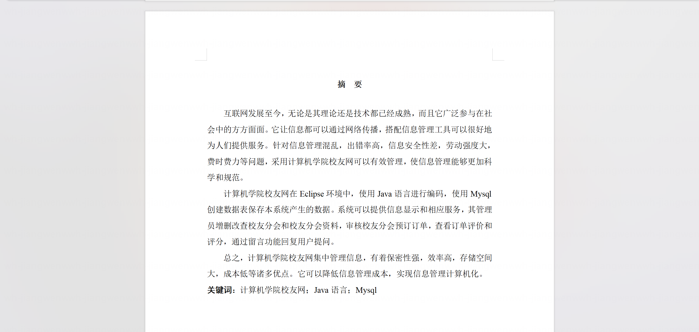
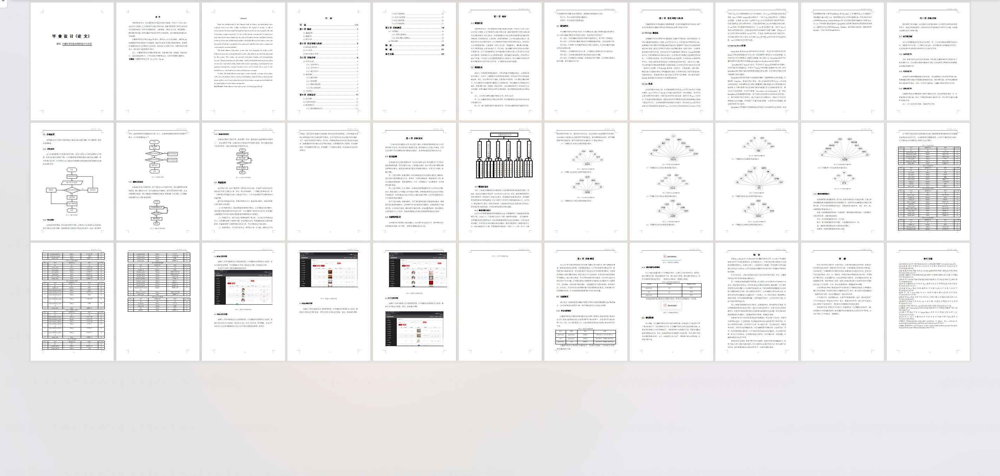
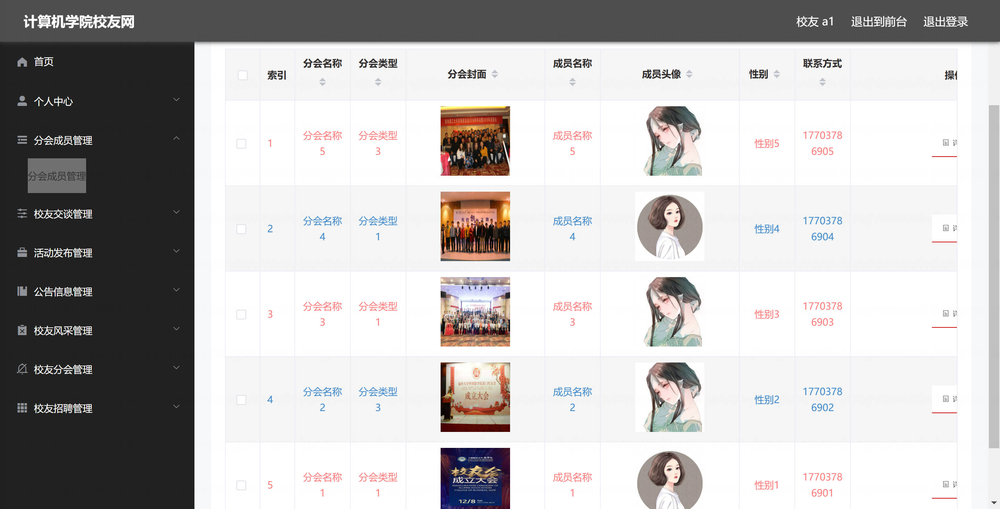
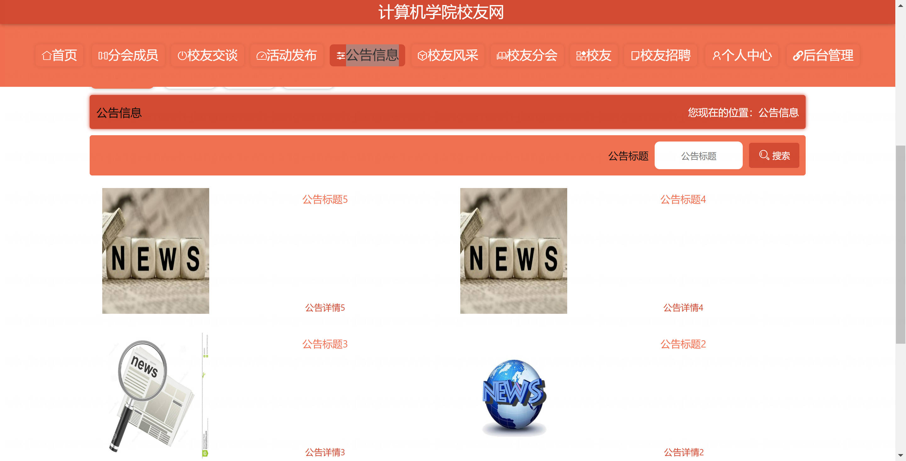
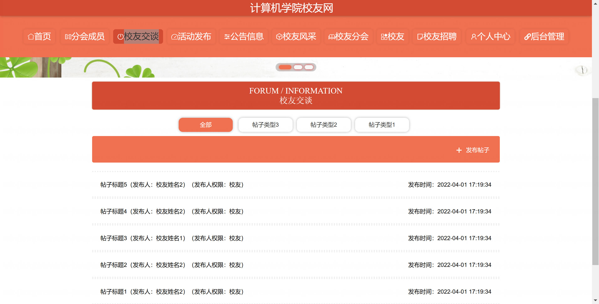
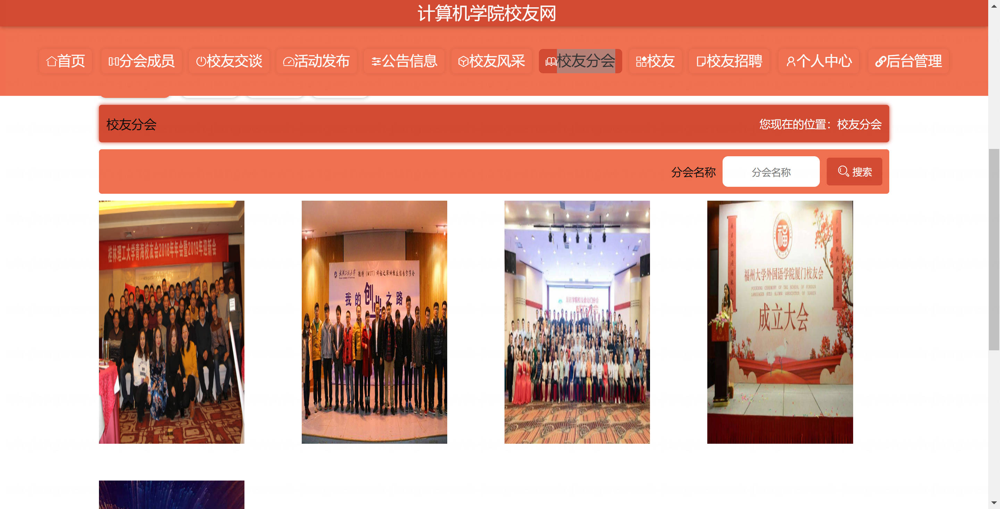
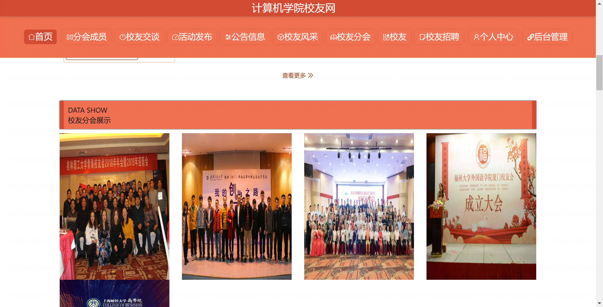
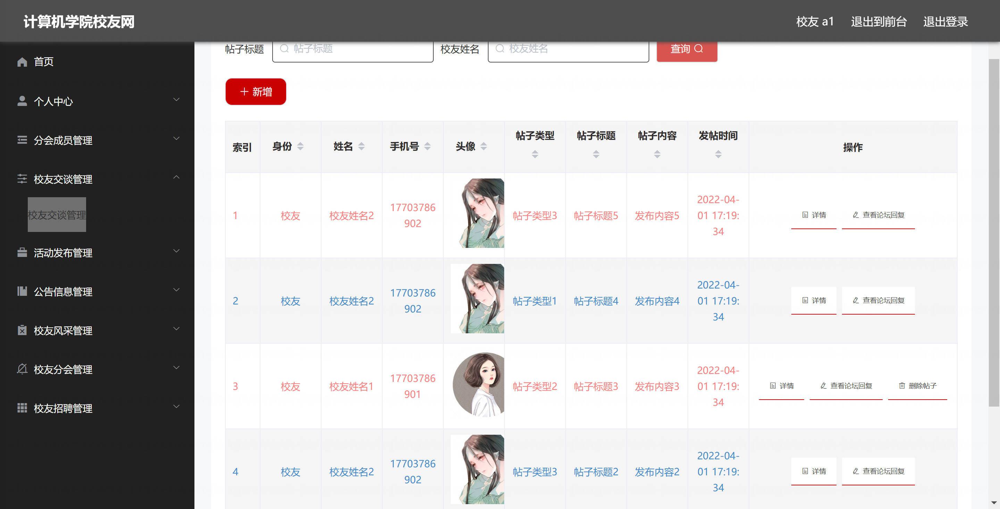

<h1 align="center">基于SpringBoot的计算机学院校友网【带论文】</h1>

- <b>完整代码获取地址：从戎源码网 ([https://armycodes.com/](https://armycodes.com/))</b>
- <b>技术探讨、资料分享，请加QQ群：692619798</b>
- <b>作者微信：19941326836  QQ：3645296857</b>
- <b>承接计算机毕业设计、Java毕业设计、Python毕业设计、深度学习、机器学习</b>
- <b>选题+开题报告+任务书+程序定制+安装调试+论文+答辩ppt 一条龙服务</b>
- <b>所有选题地址 ([https://github.com/Descartes007/allProject](https://github.com/Descartes007/allProject)) </b>

## 一、项目介绍

基于SpringBoot的计算机学院校友网，系统角色主要为后台管理员和前端校友，主要功能如下
### 管理员（后台管理）：
- 基本操作：登录、退出、修改密码、获取个人信息、修改个人信息、会话管理（session）
- 权限与菜单：角色管理（新增/查看/删除/筛选/获取列表）、菜单管理（新增/获取列表/查看详情）
- 用户与校友管理：校友管理（筛选校友、获取校友列表、查看校友详情、新增校友、修改校友、删除校友）、后台用户管理（列表/分页/筛选/新增/修改/删除/重置密码）
- 分会与成员管理：校友分会管理（新增/列表/查看/修改/删除）、分会成员管理（分页/筛选/详情）
- 内容管理：公告管理（发布/列表/查看/删除）、活动管理（发布/列表/查看/删除）、校友风采管理（发布/列表/查看/删除）、校友招聘管理（发布/列表/查看/删除）、校友交谈（论坛）管理（审核/删除/查看）
### 校友（前端用户）：
- 基本操作：登录、注册、修改密码、获取/修改个人信息、个人中心
- 信息浏览：查看首页轮播与导航、查看公告列表与详情、查看活动列表与详情、查看校友风采列表与详情、查看招聘信息列表与详情、查看校友分会与成员列表
- 内容发布与互动：在个人中心或前端发布/编辑个人风采、报名/发布活动或招聘（视权限）、参与校友交谈（发帖/评论/查看）
- 资料与媒体：上传头像、上传文章或图片（富文本编辑器支持）

## 二、项目技术

- 编程语言：Java（后端）
- 项目架构：B/S 架构
- 前端技术：Vue 2、Vue Router、Element UI、Axios、vue-quill-editor（富文本）
- 后端技术：Spring Boot 2.x（Tomcat 嵌入式）、Spring MVC、MyBatis / MyBatis-Plus、、Token 会话管理、MySQL

## 三、运行环境

- JDK版本：1.8及以上都可以
- 操作系统：Windows7/10、MacOS
- 开发工具：IDEA、Ecplise、MyEclipse都可以

## 四、数据库配置文件

- npm版本：6.14.13及以上都可以
- Redis版本：3.2.100及以上都可以
- 文件名：application.yml
- 编码类型：utf8

## 论文截图

## 系统截图

